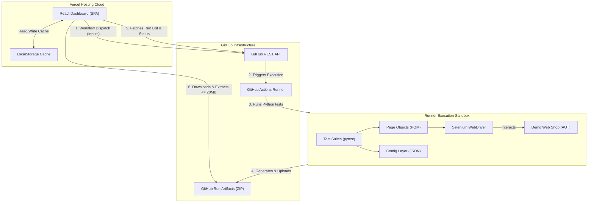
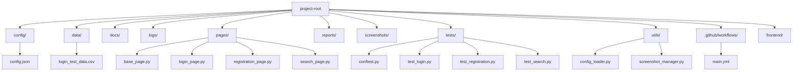

# Enterprise-Ready QA Automation Framework (Python + Selenium)

This repository contains a professional, recruiter-ready **QA Automation Platform** designed using Python, Selenium WebDriver, Pytest, and a serverless React + Vite dashboard. The target application under test is the public **Demo Web Shop** (https://demowebshop.tricentis.com/).

---

## 1. Project Overview

This framework showcases end-to-end regression validation, containerized testing configurations, CI/CD automated orchestration, and a centralized reporting dashboard. It serves as a final-year CS portfolio item and a showcase of software testing practices.

---

## 2. Problem Statement

In automated testing environments, regression validation suites are often isolated from non-technical stakeholders. Running tests requires console commands, and reading HTML logs requires looking inside CI runners or checking file directories. Development teams need:
- An intuitive graphical user interface to trigger and monitor tests.
- Immediate failure diagnosis with screenshots, base64 captures, and highlights.
- Containerized, headless sandboxes that run in CI/CD without local browser dependencies.

---

## 3. Solution

This framework solves these needs by decoupling test scripting from browser control, reporting, and execution triggers:
1. **Decoupled Page Object Model (POM)**: Isolates page actions, locators, and assertions.
2. **Serverless Orchestrator Dashboard**: A React Vite application hosted on Vercel that interacts directly with the GitHub Actions REST API.
3. **Headless Execution & Auto-Reporting**: Pytest execution inside Docker containers, outputting interactive HTML logs with automatic red element highlights on failure.

---

## 4. Features

- **Decoupled Architecture**: Separation of locators, test scripts, base page wrappers, and configuration settings.
- **Data-Driven Testing (DDT)**: Parametrized test scenarios populated from external CSV records.
- **Visual Diagnostics**: Selenium execution highlights failing elements in red before capturing screenshots.
- **Docker Sandbox**: Local execution via Docker Compose, auto-mounting reports, logs, and screenshots back to the host machine.
- **Workflow Dispatch Engine**: Manual triggering of test suites from the React dashboard using parameters (browser selection, retry counts, environment profiles).
- **Stale-While-Revalidate Caching**: Fast loading of test metrics and runs list cache using local browser storage.
- **Artifact Size Guarding**: Browser-level size boundaries that handle archives $\le$ 20MB in-browser and enable direct zip downloads for larger payloads.

---

## 5. Technology Stack

- **Core Backend**: Python 3.10+, Selenium WebDriver, Pytest, Pytest-HTML
- **UI Dashboard**: React (v19), Vite, TypeScript, Lucide Icons, JSZip, Vanilla CSS (with glassmorphism styling)
- **Infrastructure**: Docker, Docker Compose, GitHub Actions, Vercel Hosting

---

## 6. Architecture Diagram

The system components and communication paths are structured as follows:



---

## 7. Folder Structure

The repository is modularly structured, with each layer separated cleanly:



- **`config/`**: Dynamic parameters (urls, timeouts) in `config.json`.
- **`data/`**: Parameterized CSV files for data-driven runs.
- **`docs/`**: Technical guides and setup walkthroughs.
- **`frontend/`**: Vite + TypeScript dashboard source code.
- **`logs/`**, `reports/`, `screenshots/`: Local output directories (Git-ignored).
- **`pages/`**: Locators and element operations.
- **`tests/`**: Pytest regression suites and execution fixtures.
- **`utils/`**: Shared framework loaders and screenshot helpers.

---

## 8. Installation

To set up the backend and frontend components locally, please follow the detailed setup manual:
👉 [Local Setup & Execution Guide](file:///c:/Projects/QA-testing/docs/LOCAL_SETUP.md)

---

## 9. Local Execution

Run the backend Pytest automation suite directly from your terminal:

```bash
# Activate virtual environment
venv\Scripts\activate  # On Windows
source venv/bin/activate  # On macOS/Linux

# Execute tests headlessly
pytest

# Execute tests and output a self-contained HTML report
pytest --html=reports/report.html --self-contained-html
```

---

## 10. Docker Execution

Build the container image and execute tests headlessly without any local browser dependencies:

```bash
# Launch test suite run
docker-compose up --build

# Shutdown container boxes
docker-compose down
```

Test logs (`automation.log`), screenshots, and HTML reports will sync directly to your local folders.

---

## 11. GitHub Actions

All tests are integrated into a Continuous Integration pipeline defined in `.github/workflows/main.yml`.
- **Triggering**: Triggers automatically on pull request/code push, or manually via **Workflow Dispatch** inputs.
- **Parameters**: Custom execution variables (environment, browser selection, headless toggle, retry limit) can be configured dynamically.

---

## 12. Dashboard

The frontend React dashboard is hosted on Vercel. 
- **Features**: Triggers new runs on-demand, shows live execution stats, caches run histories, and extracts ZIP reports in the browser.
- **Security**: Utilizes transient in-memory credentials (`githubPat`) that are wiped on refresh.

---

## 13. Reports

Pytest generates a consolidated execution log:
- **Interactive Metrics**: HTML files list duration, step outcomes, and logger printouts.
- **Diagnostic Embeds**: Browser type, window size, base URL, and failure traces are packaged inside the report.

---

## 14. Screenshots

If a validation step fails:
- JavaScript identifies the target element and highlights it with a **red border**.
- The page takes a screenshot and saves it as a `.png` file.
- The screenshot is converted to a base64 string and embedded inside the HTML report for instant parsing.

---

## 15. Future Enhancements

- **Playwright Migration**: Transition code layers to Playwright for faster async interactions.
- **Grafana Reporting**: Integrate reporting outputs with Grafana dashboards for metric analytics.
- **Parallel Thread Pools**: Use `pytest-xdist` to execute parallel test sessions across multiple worker threads.

---

## 16. Contributing

This project is open-source. Pull requests are welcome. For major structural changes, please open an issue first to discuss what you would like to modify.

---

## 17. License

Distributed under the **MIT License**. See `LICENSE` for details.
