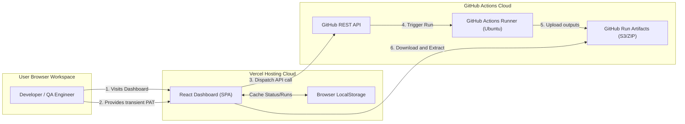

# Setup & Deployment Guide

This document provides instructions on setting up and running the automation framework locally, within Docker containers, and inside CI/CD pipelines.

---

## 1. Local Development Setup

### 1.1 Prerequisites
- **Python**: version 3.8 or higher.
- **Browsers**: Google Chrome or Mozilla Firefox installed locally.
- **WebDriver Binaries**: Automatically managed by `webdriver-manager`. No manual driver downloads are required.

### 1.2 Installation Steps
Clone this project directory and install python packages:
```bash
# Using Makefile
make install

# Using standard Pip command
pip install -r requirements.txt
```

---

## 2. Running Tests Locally

You can run tests using either the `Makefile` wrappers or directly via the `pytest` command line.

### 2.1 Using Makefile (Recommended)
```bash
# Run tests headlessly (Default Chrome browser, QA environment)
make test-headless

# Run tests with visual browser execution
make test

# Format code using black and isort
make format

# Lint code using flake8
make lint

# Clean cached test outputs, reports, logs, and screenshots
make clean
```

### 2.2 Using Pytest CLI Commands
The framework supports overriding configurations via CLI arguments:
```bash
# Run tests on Firefox browser
pytest -v --browser firefox

# Run tests in development environment
pytest -v --env development

# Run tests headlessly on Chrome
pytest -v --browser chrome --headless true
```

---

## 3. Containerized Execution (Docker)

Docker allows you to run the tests in an isolated, headless environment without needing to install Python, browsers, or webdrivers on the host machine.

### 3.1 Docker Compose Execution (Recommended)
This runs the tests in a headless Chrome container. The reports, logs, and screenshots are mounted back to your host machine's directories automatically via volume mappings.

```bash
# Build and execute the test container suite
docker-compose up --build

# Run in background mode
docker-compose up -d

# Stop running containers and clean resources
docker-compose down
```

### 3.2 Running raw Docker Commands (Alternative)
```bash
# Build Docker image
docker build -t qa-automation-runner .

# Execute container and bind directories to access execution results
docker run --rm \
  -v "$(pwd)/reports:/usr/src/app/reports" \
  -v "$(pwd)/screenshots:/usr/src/app/screenshots" \
  -v "$(pwd)/logs:/usr/src/app/logs" \
  qa-automation-runner
```

---

## 4. Continuous Integration (GitHub Actions)

The repository contains a CI pipeline configured in `.github/workflows/main.yml`.

- **Triggers**: Runs automatically on every push or pull request to the `main` or `master` branch.
- **Environment**: Sets up a headless virtual environment on an `ubuntu-latest` runner.
- **Execution**: Installs dependencies and executes `pytest` tests headlessly.
- **Artifacts**:
  - **HTML Execution Reports** are uploaded under the name `execution-report` (always uploaded).
  - **Failure Screenshots** are uploaded under the name `failure-screenshots` (uploaded only if a test fails).

---

## 5. System Deployment Diagram

The system is deployed across a serverless static hosting provider (Vercel) and GitHub's runner infrastructure, bypassing the need for dedicated server maintenance.



