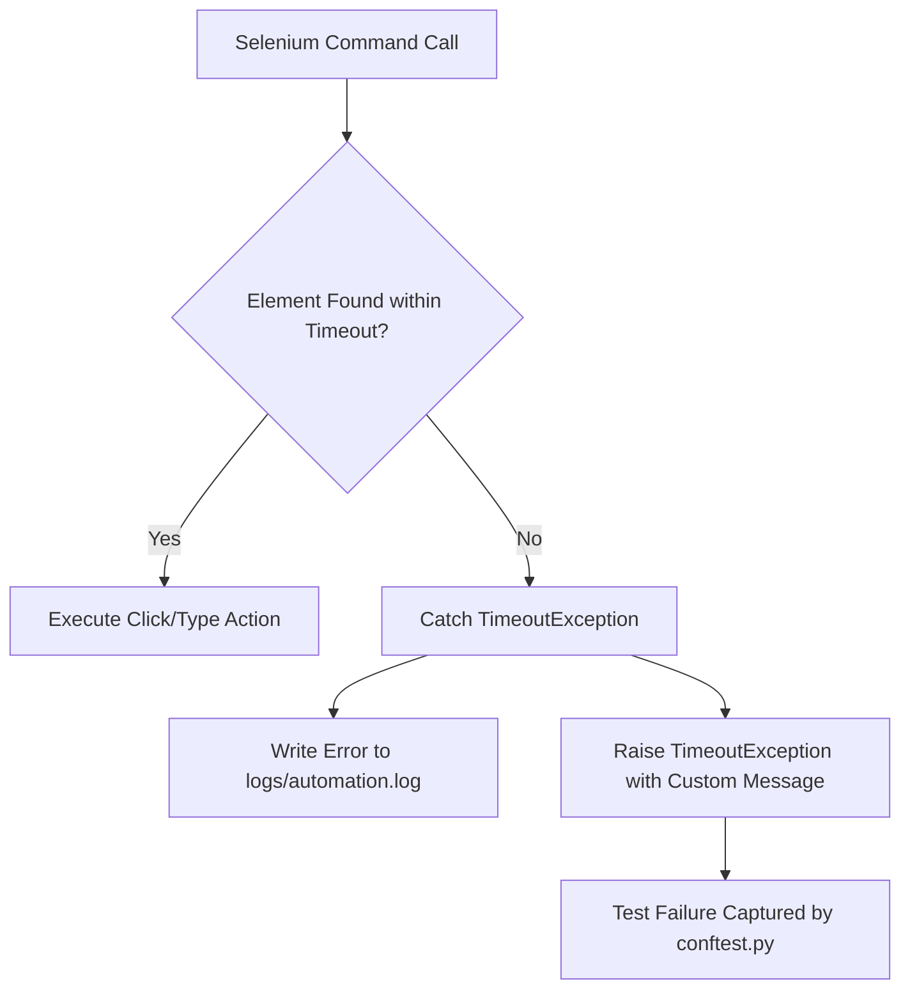

# Error Handling & Diagnostic Strategy

This document details the error handling mechanisms, logging configurations, and failure isolation design built into the automation framework.

---

## 1. Exception Handling in Page Objects

We avoid raw Selenium calls inside test scripts to prevent unhandled driver crashes. The Page Object layer encapsulates elements locating and clicking inside explicit waits.



### 1.1 Explicit Waits (No Silent Failures)
All interactions rely on `WebDriverWait` defined in [base_page.py](file:///c:/Projects/QA-testing/pages/base_page.py):
- Element clicks wait for the element to be clickable (`EC.element_to_be_clickable`).
- Text insertion waits for visibility (`EC.visibility_of_element_located`).
- Multi-element counts wait for presence (`EC.presence_of_all_elements_located`).

If an element fails to load, Pytest throws a `TimeoutException`. The framework captures this exception, logs it, and provides a clear description of which locator failed.

---

## 2. Failure Diagnostics & Logging

On test failure, the framework captures the failure state immediately inside the reporting hooks in [conftest.py](file:///c:/Projects/QA-testing/tests/conftest.py).

### 2.1 Failure Capture Workflow
1. **Highlighting**: If the element that caused the failure is identified, `ScreenshotManager` executes a JavaScript border highlight:
   ```javascript
   arguments[0].style.border='3px solid red';
   ```
2. **Timestamped PNG**: A screenshot is captured and saved with a unique name containing the test ID, active browser, environment name, and timestamp.
3. **Metadata Collection**: The framework queries the active WebDriver instance for:
   - Current page URL.
   - Browser name and version.
   - Screen resolution settings.
4. **HTML Report Binding**: The HTML report compiles these values, embeds the screenshot, and prints a formatted stack trace.

---

## 3. Log Formatting Specifications

Logs are saved inside [logs/automation.log](file:///c:/Projects/QA-testing/logs/automation.log) in a standardized structure:
```text
TIMESTAMP [LEVEL] LOGGER_NAME: LOG_MESSAGE
```

### Example Logs Analysis
```text
2026-06-19 18:15:11 [INFO] conftest: Launching WebDriver session. Browser: CHROME, Headless: true
2026-06-19 18:15:13 [INFO] base_page: Navigating to URL: https://demowebshop.tricentis.com/login
2026-06-19 18:15:15 [INFO] login_page: Attempting login for email: 'tester_antigravity@test.com'
2026-06-19 18:15:16 [INFO] base_page: Entering text into field: (By.ID, Email)
2026-06-19 18:15:16 [INFO] base_page: Clicking element: (By.CSS_SELECTOR, input.login-button)
2026-06-19 18:15:18 [INFO] login_page: Validating login success via presence of Logout link.
2026-06-19 18:15:20 [ERROR] base_page: Timeout waiting for element visibility with locator: (By.LINK_TEXT, Log out)
2026-06-19 18:15:20 [WARNING] screenshot_manager: Failure screenshot captured successfully: screenshots/test_login_scenarios_chrome_qa_2026-06-19_18-15-20.png
2026-06-19 18:15:21 [INFO] conftest: Shutting down WebDriver session.
```
This logging structure allows developers to trace exactly where a test failed and inspect the corresponding screenshot for debugging.
