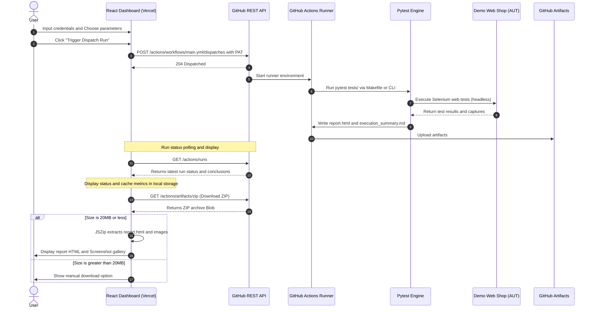

# Test Execution Flow Guide

This document describes the step-by-step lifecycle of test runs, explaining how pytest boots up, manages the WebDriver, catches execution issues, and builds the reporting artifacts.

---

## 1. Test Execution Flow Diagram

The diagram below details the sequence of events from when the user types the execution command to the final report files generation.

---

## 2. Step-by-Step Breakdown

### Step 1: Bootstrapping & Setup
- **Command Invocation**: The run starts when the `pytest` engine executes.
- **Config & Log Binding**: Pytest invokes `pytest_configure` in `conftest.py`. The `ConfigLoader` reads configurations and CLI flags to bind active environments. Logger handlers are created to append events to `logs/automation.log`.
- **Rerun configuration**: Pytest-rerunfailures reads settings to apply retry logic dynamically.

### Step 2: Test Initialization
- **Driver Setup**: Before each test function, the `driver` fixture resolves options, spins up a browser instance, configures implicit waits, and returns the driver.
- **Context Injection**: The test function obtains the driver reference, which is automatically saved on the pytest execution item for hook lookup.

### Step 3: Test Execution & Interactions
- **Action Execution**: The test interacts with Page Objects (e.g. `LoginPage`). Page Objects carry out explicit waits and click/input operations.
- **Logs Recording**: Details of element interaction steps are saved dynamically to `logs/automation.log`.

### Step 4: Failure Catching & Screenshot Workflow
- **Exception Interception**: If a step throws an assertion or WebDriver timeout, the test fails. The `pytest_runtest_makereport` wrapper catches the error state.
- **Screenshot Highlights**: `ScreenshotManager` executes JS inside the browser to highlight the failed element with a red border, captures the screen to a `.png` file, and resolves base64 data.
- **Diagnostics Formatting**: Browser URL, active resolutions, error logs, and stack traces are formatted in HTML and embedded inside the Pytest HTML report output.

### Step 5: Session Completion
- **Teardown**: The driver execution is closed with `driver.quit()`.
- **Reporting outputs**: `pytest_sessionfinish` gathers outcome statistics across all run items, writes `reports/execution_summary.md`, and generates `reports/report.html`.
