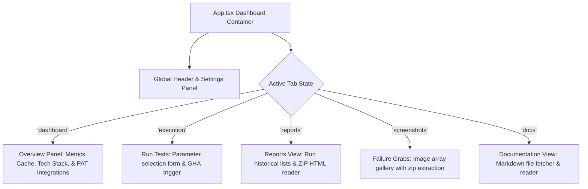
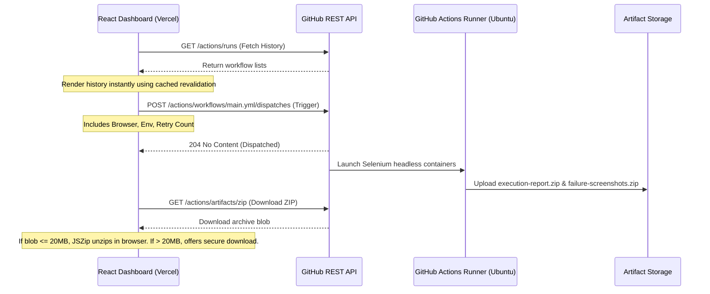

# Frontend Dashboard Guide

This document describes the design architecture, directory layout, routing mechanism, local caching features, API flows, and deployment steps for the portfolio-ready **QA Automation Dashboard**.

---

## 1. Directory Structure

The frontend application is contained within the `frontend/` directory at the root of the workspace. Its design adheres to modern Vite + React templates configured for TypeScript.

```text
frontend/
├── package.json               # Configures React, Lucide-React, JSZip, and TypeScript tools
├── vite.config.ts             # Bundler settings directing builds
├── tsconfig.json              # TypeScript compilation overrides
├── index.html                 # Entry HTML rendering page template
├── src/
│   ├── main.tsx               # Bootstrapping script initializing React DOM
│   ├── App.tsx                # Single Page Application controller containing state and view tab routes
│   ├── index.css              # Custom styling definitions implementing the glassmorphism theme
│   └── App.css                # Base layout styles
```

---

## 2. Component Hierarchy & Tabs

To keep compilation fast and deployment lightweight, the system uses a **Single Page Application (SPA)** model. Tabs are managed via React in-memory states instead of a heavy router package, ensuring optimal speed.



---

## 3. State & Credentials Management

### 3.1 Security Decision: Rejecting LocalStorage for PATs
- **Critical Decoupling**: Personal Access Tokens (PATs) are **never** committed to `localStorage` or `sessionStorage` to prevent Cross-Site Scripting (XSS) extraction.
- **In-Memory Handling**: Token inputs are preserved in a transient React state variable (`githubPat`). Once the browser tab is refreshed or closed, the credentials are wiped clean.
- **Scope Limitation**: For reading public runs or repo files, the app defaults to public GitHub API calls (no token needed). Authentication is requested only for writing actions (`workflow_dispatch`) and private artifact downloads.

### 3.2 Client-Side Caching (Stale-While-Revalidate)
To improve latency and provide resume-ready offline behavior:
- **`qa_dashboard_cache`**: Persists the latest run state (`latestStatus`), execution outcome (`latestSummary`), and context metadata inside `localStorage`.
- **`qa_dashboard_runs_cache`**: Persists the array of the latest workflow runs.
- **Revalidation Flow**: On mount, the dashboard loads the cached runs instantly so the screen is populated immediately. In the background, it fetches the fresh run log from GitHub and silently revalidates/updates the cache.

---

## 4. GitHub Actions API Integration

All integrations communicate directly with the GitHub REST API (`https://api.github.com`).



---

## 5. Artifact Extraction Guidelines

### 5.1 The 20MB Boundary
To prevent browser process lockups and high memory usage, the frontend implements extraction constraints:
1. **Size <= 20MB**:
   - The file is fetched in the background as a Blob using the transient Personal Access Token.
   - `jszip` loads the archive and parses files (`report.html`, `execution_summary.md`, and screenshot `.png` images) in memory.
   - Files are converted to local browser Object URLs and rendered directly inside the dashboard.
2. **Size > 20MB**:
   - Automatic browser unzipping is disabled.
   - An informative alert is displayed.
   - A download button is displayed which downloads the ZIP file using the Personal Access Token and triggers a browser download dialog.

---

## 6. Deployment Architecture (Vercel)

The frontend is deployed as a static-only Single Page Application on Vercel:
1. **Framework Preset**: Vite
2. **Root Directory**: `frontend`
3. **Build Command**: `npm run build` (runs `tsc -b && vite build`)
4. **Output Directory**: `dist`

---

## 7. Common Debugging Steps

- **GitHub API Rate Limits (HTTP 403)**:
  If the public run list fails to load, it is likely due to IP rate limits. Configure a transient GitHub Personal Access Token in the top-right Settings modal to authenticate requests.
- **CORS Block on Artifact Downloads**:
  Artifact downloads require authentication. Make sure your transient PAT has `repo` scope permissions. If downloads fail, verify repository settings.
- **TypeScript Build Failures**:
  Run `npm run build` locally inside `frontend/` to check for compilation issues. Make sure type packages like `@types/jszip` are in sync.
- **Unzipping Failures**:
  If reports fail to render, check that the test suite execution succeeded and uploaded artifacts named `execution-report` and `failure-screenshots` containing `report.html` and `.png` images.
